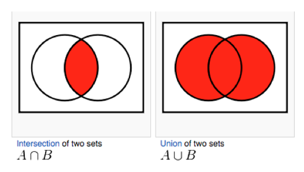

### Intersection Types

- Ampersand (&) to separate each type
- Like AND Operator but for data-types

```ts
interface Foo {
  foo: string;
  xyz: string;
}

interface Bar {
  bar: string;
  xyz: string;
}

//Union
const sayHello = (obj: Foo | Bar): any => {
  /*
   */
};

sayHello({ foo: 'foo', xyz: 'something' }); // Only Common property of both Foo and Bar Interface (just like- Intersection/common)

//intersection
const sayHello2 = (obj: Foo & Bar): any => {
  /*  */
};

sayHello2({ foo: 'foo', xyz: 'something', bar: 'bar' }); // All properties of both Foo and Bar Interface (just like- Union)
// [Words are confusing Right 😕 as per ven-diagram]
```



Intersection of Types are commonly used for -> Discriminated Unions Types

### Discriminated Unions Types

```ts
interface EmailContact {
  kind: 'email';
  email: string;
}

interface PhoneContact {
  kind: 'phone';
  phone: string;
}

// Think that Contact Information taken from client is - Dynamic (taken during run-time)
// Then we can Create a type which represents only one of the above types i.e-
type Contact = EmailContact | PhoneContact; // Thus during compile type we can take use of Strong-Typing

interface Customer {
  name: string;
  contact: Contact;
}

function displayCustomerContact(customer: Customer) {
  const { contact } = customer;
  if (contact.kind === 'email') {
    // Example -> Typescript Intelligence tell you that contact can be either email or phone
    // After Typing contact press <ctrl> + <space> button
    console.log(contact.email);
  } else {
    console.log(contact.phone);
  }
}
```

Can you think Common Usage of Discriminated Union Types ? - Remember creating Action Class in NgRx (i.e- Redux Design Pattern)

```ts
// ! Define the action type as named constant using enum
export enum DeviceActionTypes {
  SEND_TO_DEVICE = '[SEND] Send To Device',
  SEND_TO_DEVICE_SUCCESS = '[SEND_SUCCESS] Send To Device Successfully',
  SEND_TO_DEVICE_FAIL = '[SEND_FAIL] Send To Device Failure',
  NOTIFICATION_FROM_DEVICE = '[NOTIFICATION_DEVICE] Notification from Device',
}

// !Build Action Creator
export class SendToDeviceAction implements Action {
  readonly type = DeviceActionTypes.SEND_TO_DEVICE; // Type -> Action Object property
  constructor(public payload: SendReqModel) {} // Payload -> Action Object property
}

export class SendToDeviceSuccessAction implements Action {
  readonly type = DeviceActionTypes.SEND_TO_DEVICE_SUCCESS;
  constructor() {}
}

export class SendToDeviceFailAction implements Action {
  readonly type = DeviceActionTypes.SEND_TO_DEVICE_FAIL;
  constructor() {}
}

export class NotificationFromDeviceAction implements Action {
  readonly type = DeviceActionTypes.NOTIFICATION_FROM_DEVICE;
  constructor(public payload: any) {}
}

// !  Defining a Union Type for action creator
export type DeviceActions =
  | SendToDeviceAction
  | SendToDeviceSuccessAction
  | SendToDeviceFailAction
  | NotificationFromDeviceAction;
```

Let us see one more example-again for fun 😉 (I promise this time its Real-world scenario)

~ ~ ~
**Question**

- Domain: Users place orders for products. User have contact information, email or postal address and at least one is required. Orders should include name, quantity, payment date, paid amount, sending date, delivery date
- Models : User, Product, Contact, Order etc
- Info for different states
  - OrderPaid (paymentDate, amount)
  - OrderSent (sentDate)
  - OrderDelivered (deliveryDate)

~ ~ ~

**Solution**

```ts
// 🌟 Discriminated Unions of All Contacts Types 🌟
type ContactInfo =
  | { kind: 'email'; email: string }
  | { kind: 'postal'; address: string }
  | { kind: 'emailAndPostal'; email: string; postal: string };

// Customer Model
type Customer = {
  name: string;
  contact: ContactInfo;
};

// Different States of Orders
type PaidOrderData = { paymentDate: Date; amount: number };
type SentOrderData = { sentDate: Date };
type DeliveredOrderData = { deliveryDate: Date };

// 🌟 Discriminated Unions of All Order Types 🌟
type OrderState =
  | { kind: 'new' }
  | { kind: 'paid'; paidData: PaidOrderData }
  | { kind: 'sent'; paidData: PaidOrderData; sentData: SentOrderData }
  | {
      kind: 'delivered';
      paidData: PaidOrderData;
      sentData: SentOrderData;
      deliveryData: DeliveredOrderData;
    };

// Order Model
type Order = {
  id: number;
  customer: Customer;
  productName: string;
  quantity: number;
  price: number;
  orderState: OrderState;
};

function processOrder(order: Order, orderAction: OrderState) {
  if (orderAction.kind === 'new') {
    /* Some logic */
  } else if (orderAction.kind === 'paid') {
    /* Some logic-2 */
  }
}
```

I know you are graving 😋 for last example, Okay as per your need 😝

- Think you need to implement return type of Generator Function of JS
- Just to re-call Generator function in JS ex-

```ts
function* generator(i) {
  yield i;
  yield i + 10;
}

const gen = generator(10);

console.log(gen.next().value); // expected output: 10

console.log(gen.next().value); // expected output: 20
```

Solution

```ts
interface IteratorYieldResult<TResult> {
  done: false;
  value: TResult;
}

interface IteratorReturnResult<TResult> {
  done: true;
  value: TResult;
}

type IteratorResult<T, TResult> =
  | IteratorYieldResult<TResult>
  | IteratorReturnResult<TResult>;
```
